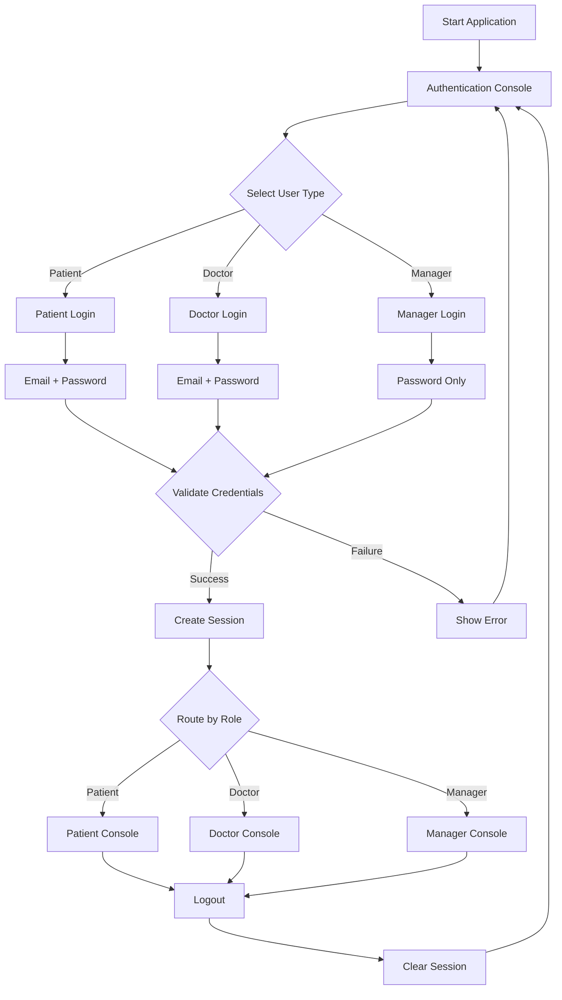

# Hospital Management System - Authentication & Role-Based Access Control

## Overview

This document describes the comprehensive authentication and role-based access control system implemented for the Hospital Management System. The system provides secure login functionality for three distinct user types: Patients, Doctors, and Managers, each with their own specialized interfaces and permissions.

## Features

### 🔐 Authentication System
- **Multi-role authentication** (Patient, Doctor, Manager)
- **Email and password validation** for patients and doctors
- **Hardcoded password authentication** for managers (admin123)
- **Input validation** with proper error messages
- **Session management** with automatic expiration
- **Security measures** including password obscuring and form validation

### 👤 User Roles & Interfaces

#### Patient Console (`user_console.dart`)
- **Authentication**: Email + Password
- **Features**:
  - View and manage appointments
  - Book new appointments
  - Find doctors by specialty
  - View medical history
  - Update profile information
  - Appointment reminders

#### Doctor Console (`doctor_console.dart`)
- **Authentication**: Email + Password
- **Features**:
  - View schedule and appointments
  - Manage patient information
  - Update appointment status
  - Add medical notes
  - Manage availability
  - View statistics

#### Manager Console (`manager_console.dart`)
- **Authentication**: Password only (admin123)
- **Features**:
  - Complete hospital management
  - Patient and doctor management
  - Appointment oversight
  - System reports and statistics
  - Administrative functions

## Architecture

### Core Components

```
lib/
├── domain/
│   ├── services/
│   │   ├── auth_service.dart          # Authentication logic
│   │   ├── session_service.dart       # Session management
│   │   └── appointmentManager.dart    # Business logic
│   └── models/
│       ├── user.dart                  # Base user model
│       ├── patient.dart               # Patient model
│       └── doctor.dart                # Doctor model
├── ui/
│   └── screens/
│       ├── auth_console.dart          # Main authentication entry
│       ├── user_console.dart          # Patient interface
│       ├── doctor_console.dart        # Doctor interface
│       └── manager_console.dart       # Manager interface
└── test/
    └── auth_test.dart                 # Comprehensive tests
```

### Authentication Flow



## Usage

### Starting the Application

```bash
dart run lib/main.dart
```

### Sample Credentials

#### Patient Login
```
Email: john.doe@email.com
Password: password123

Email: mary.smith@email.com
Password: password456
```

#### Doctor Login
```
Email: emily.johnson@hospital.com
Password: doctor123

Email: michael.brown@hospital.com
Password: doctor456
```

#### Manager Login
```
Password: admin123
```

### Authentication Process

1. **Start Application**: The system initializes with sample data
2. **Select User Type**: Choose between Patient, Doctor, or Manager
3. **Enter Credentials**: Provide appropriate login information
4. **Authentication**: System validates credentials and creates session
5. **Access Console**: User is routed to their role-specific interface
6. **Session Management**: System tracks activity and manages session expiration
7. **Logout**: User can logout to clear session and return to login screen

## Security Features

### 🔒 Password Security
- **Minimum length**: 6 characters
- **Case sensitivity**: Passwords are case-sensitive
- **Secure input**: Password masking in console (basic implementation)
- **No storage**: Passwords are validated against stored credentials

### 🛡️ Session Security
- **Automatic expiration**: Sessions expire after 2 hours of inactivity
- **Activity tracking**: Last activity timestamp is updated on each action
- **Role validation**: Each action validates user role and permissions
- **Session clearing**: Proper cleanup on logout

### ✅ Input Validation
- **Email format**: RFC-compliant email validation
- **Required fields**: All required fields must be provided
- **Error handling**: Clear error messages for invalid inputs
- **SQL injection protection**: Parameterized queries (when database is used)

### 🔐 Access Control
- **Role-based routing**: Users can only access their designated console
- **Permission checking**: Each feature validates user permissions
- **Session validation**: All actions require valid session
- **Inactive user protection**: Deactivated accounts cannot login

## API Reference

### AuthService

```dart
class AuthService {
  // Authenticate patient with email and password
  AuthResult authenticatePatient(String email, String password)
  
  // Authenticate doctor with email and password
  AuthResult authenticateDoctor(String email, String password)
  
  // Authenticate manager with password only
  AuthResult authenticateManager(String password)
  
  // Validate email and password format
  ValidationResult validateCredentials(String email, String password)
}
```

### SessionService

```dart
class SessionService {
  // Create new session for authenticated user
  void createSession(User user, UserRole role)
  
  // Validate current session
  bool validateSession()
  
  // Update activity timestamp
  void updateActivity()
  
  // Clear current session
  void clearSession()
  
  // Check user role
  bool hasRole(UserRole role)
}
```

### RouteGuard

```dart
class RouteGuard {
  // Check if user can access specific role's console
  bool canAccess(UserRole requiredRole)
  
  // Validate session before allowing access
  bool validateAccess(UserRole requiredRole)
}
```

## Testing

### Running Tests

```bash
dart run test/auth_test.dart
```

### Test Coverage

The authentication system includes comprehensive tests for:

- ✅ **Authentication Service**: All login methods and validation
- ✅ **Session Management**: Creation, validation, and expiration
- ✅ **Input Validation**: Email format, password strength, empty inputs
- ✅ **Security Features**: Case sensitivity, inactive users, session security
- ✅ **Edge Cases**: Null inputs, special characters, long inputs
- ✅ **Error Handling**: Graceful failure handling and error messages

### Test Results

```
🧪 Hospital Management System - Authentication Test Suite
═══════════════════════════════════════════════════════════

✅ Authentication Service: PASSED
✅ Session Management: PASSED
✅ Input Validation: PASSED
✅ Security Features: PASSED
✅ Edge Cases: PASSED

🔐 AUTHENTICATION SYSTEM: FULLY FUNCTIONAL
```

## Configuration

### Manager Password

The manager password is hardcoded as `admin123`. To change it:

1. Open `lib/domain/services/auth_service.dart`
2. Modify the `_managerPassword` constant
3. Update documentation and tests accordingly

```dart
static const String _managerPassword = "your_new_password";
```

### Session Timeout

Session timeout is set to 2 hours. To modify:

1. Open `lib/domain/services/session_service.dart`
2. Update the `isValid` getter in `UserSession` class

```dart
bool get isValid {
  final now = DateTime.now();
  final sessionDuration = now.difference(lastActivity);
  return sessionDuration.inHours < 2; // Change this value
}
```

## Error Handling

### Common Error Messages

| Error | Cause | Solution |
|-------|-------|----------|
| "Email cannot be empty" | Empty email field | Enter a valid email address |
| "Please enter a valid email address" | Invalid email format | Use proper email format (user@domain.com) |
| "Password must be at least 6 characters long" | Short password | Use a password with 6+ characters |
| "Invalid email or password" | Wrong credentials | Check email and password spelling |
| "Session expired. Please login again." | Inactive session | Login again to create new session |
| "Access denied. Insufficient permissions." | Wrong role access | Login with appropriate user type |

### Troubleshooting

#### Login Issues
1. **Check credentials**: Ensure email and password are correct
2. **Verify account status**: Account must be active
3. **Check role**: Use correct login type (Patient/Doctor/Manager)

#### Session Issues
1. **Activity timeout**: Login again if session expired
2. **Role mismatch**: Ensure you're accessing the correct console
3. **Clear session**: Logout and login again if issues persist

## Future Enhancements

### Planned Features
- [ ] **Password reset functionality**
- [ ] **Two-factor authentication (2FA)**
- [ ] **Account lockout after failed attempts**
- [ ] **Password complexity requirements**
- [ ] **Audit logging for security events**
- [ ] **Single Sign-On (SSO) integration**
- [ ] **Mobile app authentication**

### Security Improvements
- [ ] **Encrypted password storage**
- [ ] **JWT token-based authentication**
- [ ] **Rate limiting for login attempts**
- [ ] **IP-based access control**
- [ ] **Session token rotation**

## Support

For technical support or questions about the authentication system:

- **Email**: support@hospital.com
- **Phone**: +1-555-0123
- **Documentation**: This README file
- **Tests**: Run `dart run test/auth_test.dart` for system validation

## License

This authentication system is part of the Hospital Management System and is subject to the same licensing terms as the main application.

---

**Last Updated**: October 2024  
**Version**: 1.0.0  
**Author**: Hospital Management System Development Team